# Budget Travel App - Colorful Mermaid.js UI/UX Flow Diagrams 🎨

## 🌈 Interactive User Flow Diagrams with Vibrant Styling

### 1. 🆕 Complete User Journey Flow

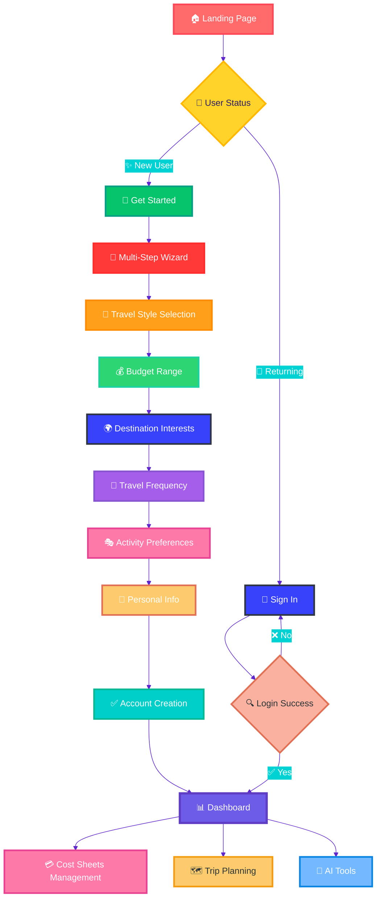

### 2. 🔐 Authentication & Access Control Flow

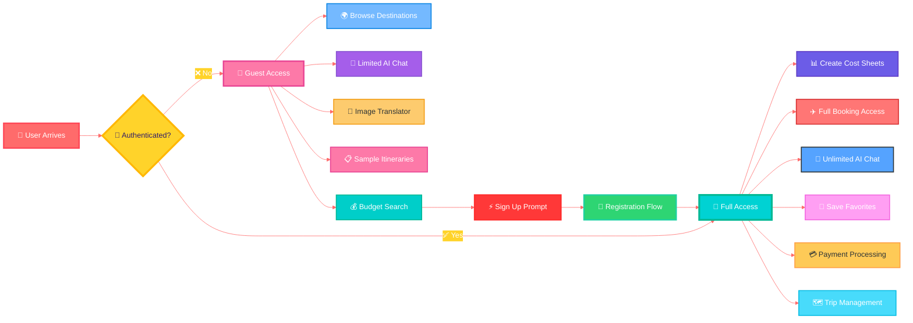

### 3. 🧭 Trip Planning Workflow

```mermaid
%%{init: {'theme':'base', 'themeVariables': { 'primaryColor': '#a55eea', 'primaryTextColor': '#fff', 'primaryBorderColor': '#8854d0', 'lineColor': '#00d2d3', 'secondaryColor': '#fd79a8', 'tertiaryColor': '#74b9ff'}}}%%
flowchart TD
    A["💡 Inspiration Phase"] --> B["🔍 Research Phase"]
    B --> C["📋 Planning Phase"]
    C --> D["🎯 Booking Phase"]
    D --> E["📊 Management Phase"]
    
    A --> A1["💰 Budget Search"]
    A --> A2["🤖 AI Chat Assistance"]
    A --> A3["📸 Image Upload Analysis"]
    
    B --> B1["🌍 Destination Details"]
    B --> B2["💵 Price Comparisons"]
    B --> B3["⭐ Reviews & Ratings"]
    B --> B4["🌤️ Weather Information"]
    
    C --> C1["📝 Create Cost Sheet"]
    C --> C2["🗓️ Build Itinerary"]
    C --> C3["💳 Budget Allocation"]
    C --> C4["📅 Date Planning"]
    
    D --> D1["🏨 Hotel Booking"]
    D --> D2["✈️ Flight Booking"]
    D --> D3["🍽️ Restaurant Reservations"]
    D --> D4["👥 Tour Guide Booking"]
    D --> D5["💸 Payment Processing"]
    
    E --> E1["📈 Expense Tracking"]
    E --> E2["🔄 Itinerary Updates"]
    E --> E3["🔔 Real-time Notifications"]
    E --> E4["🤝 Trip Sharing"]
    
    style A fill:#ff6b6b,stroke:#ff4757,stroke-width:4px,color:#fff
    style B fill:#ffd32a,stroke:#ffb700,stroke-width:4px,color:#2f1b69
    style C fill:#00d2d3,stroke:#00b894,stroke-width:4px,color:#fff
    style D fill:#a55eea,stroke:#8854d0,stroke-width:4px,color:#fff
    style E fill:#fd79a8,stroke:#e84393,stroke-width:4px,color:#fff
    
    style A1 fill:#74b9ff,stroke:#0984e3,stroke-width:2px,color:#fff
    style A2 fill:#fdcb6e,stroke:#f39c12,stroke-width:2px,color:#2d3436
    style A3 fill:#55efc4,stroke:#00b894,stroke-width:2px,color:#2d3436
    
    style B1 fill:#6c5ce7,stroke:#5f3dc4,stroke-width:2px,color:#fff
    style B2 fill:#ff7675,stroke:#d63031,stroke-width:2px,color:#fff
    style B3 fill:#feca57,stroke:#ff9f43,stroke-width:2px,color:#2d3436
    style B4 fill:#48dbfb,stroke:#0abde3,stroke-width:2px,color:#fff
    
    style C1 fill:#ff9ff3,stroke:#f368e0,stroke-width:2px,color:#fff
    style C2 fill:#54a0ff,stroke:#2f3542,stroke-width:2px,color:#fff
    style C3 fill:#5f27cd,stroke:#341f97,stroke-width:2px,color:#fff
    style C4 fill:#00d8d6,stroke:#01a3a4,stroke-width:2px,color:#fff
    
    style D1 fill:#ff3838,stroke:#ff2d2d,stroke-width:2px,color:#fff
    style D2 fill:#ff9f1a,stroke:#ff8c00,stroke-width:2px,color:#fff
    style D3 fill:#2ed573,stroke:#1dd1a1,stroke-width:2px,color:#fff
    style D4 fill:#3742fa,stroke:#2f3542,stroke-width:2px,color:#fff
    style D5 fill:#f1c40f,stroke:#f39c12,stroke-width:2px,color:#2d3436
    
    style E1 fill:#e17055,stroke:#d63031,stroke-width:2px,color:#fff
    style E2 fill:#fd79a8,stroke:#e84393,stroke-width:2px,color:#fff
    style E3 fill:#fdcb6e,stroke:#e17055,stroke-width:2px,color:#fff
    style E4 fill:#00cec9,stroke:#00b894,stroke-width:2px,color:#fff
```

### 4. 💰 Cost Sheet Management Flow

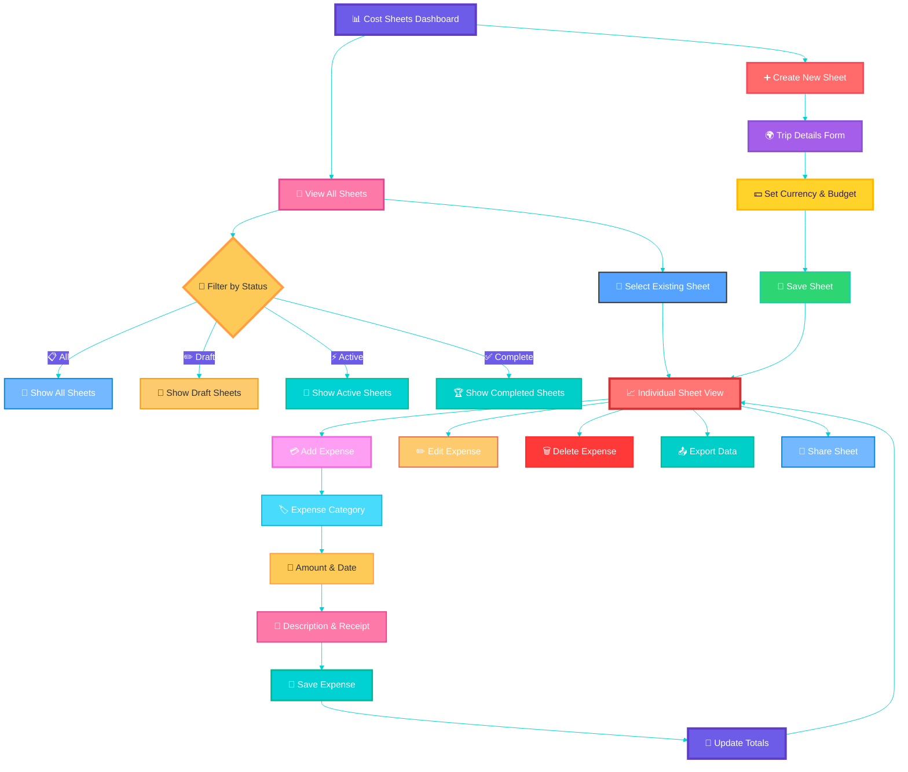

### 5. 🎯 Booking Process Flow

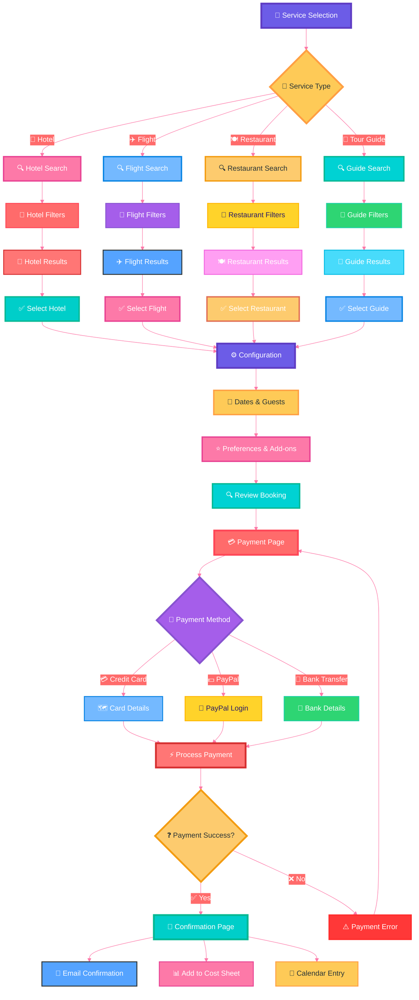

### 6. 🤖 AI Assistant Interaction Flow

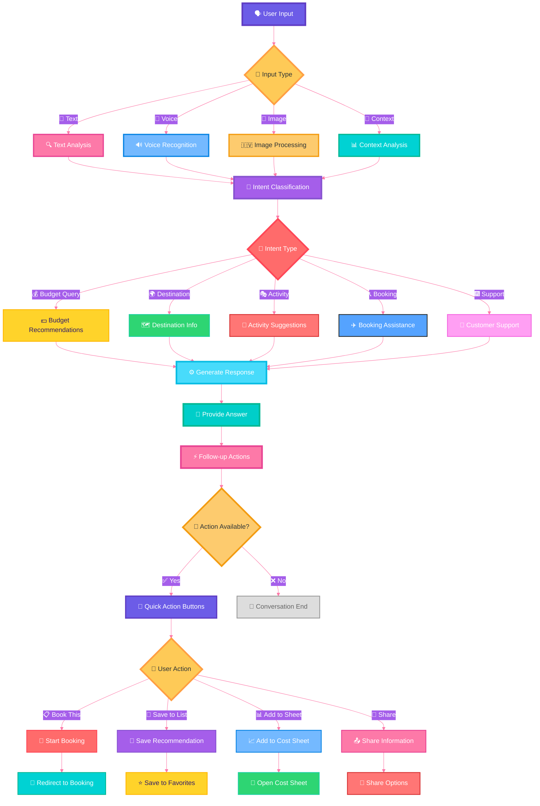

### 7. 📱 Mobile vs Desktop Experience Flow

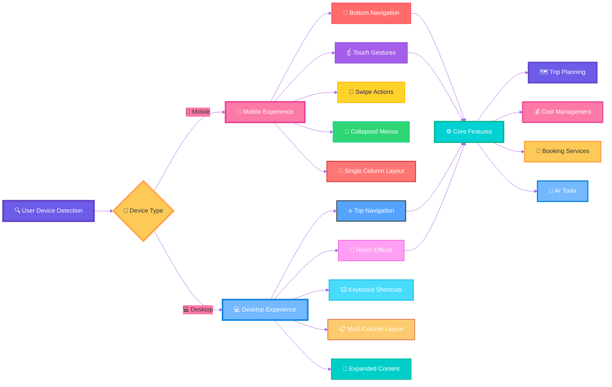

### 8. 🔄 State Management & Real-time Updates

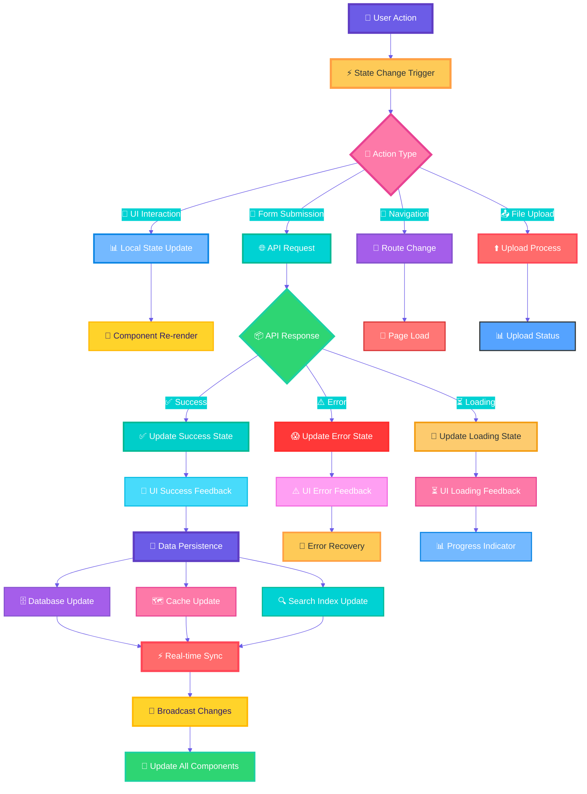

### 9. 🔍 Search & Discovery Flow

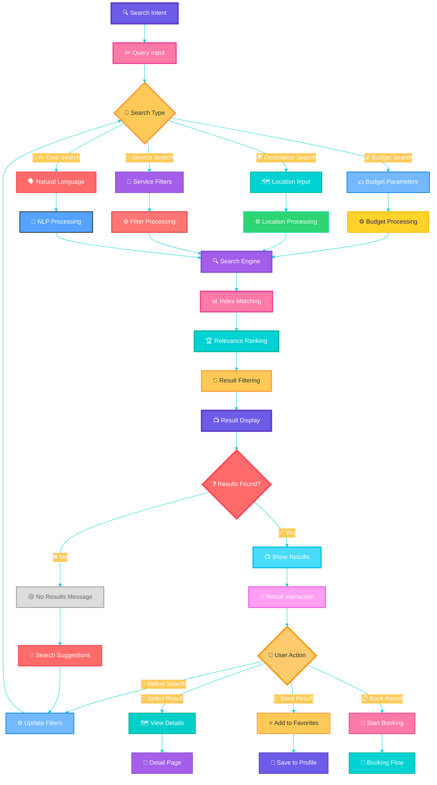

### 10. ⚡ Performance & Loading States

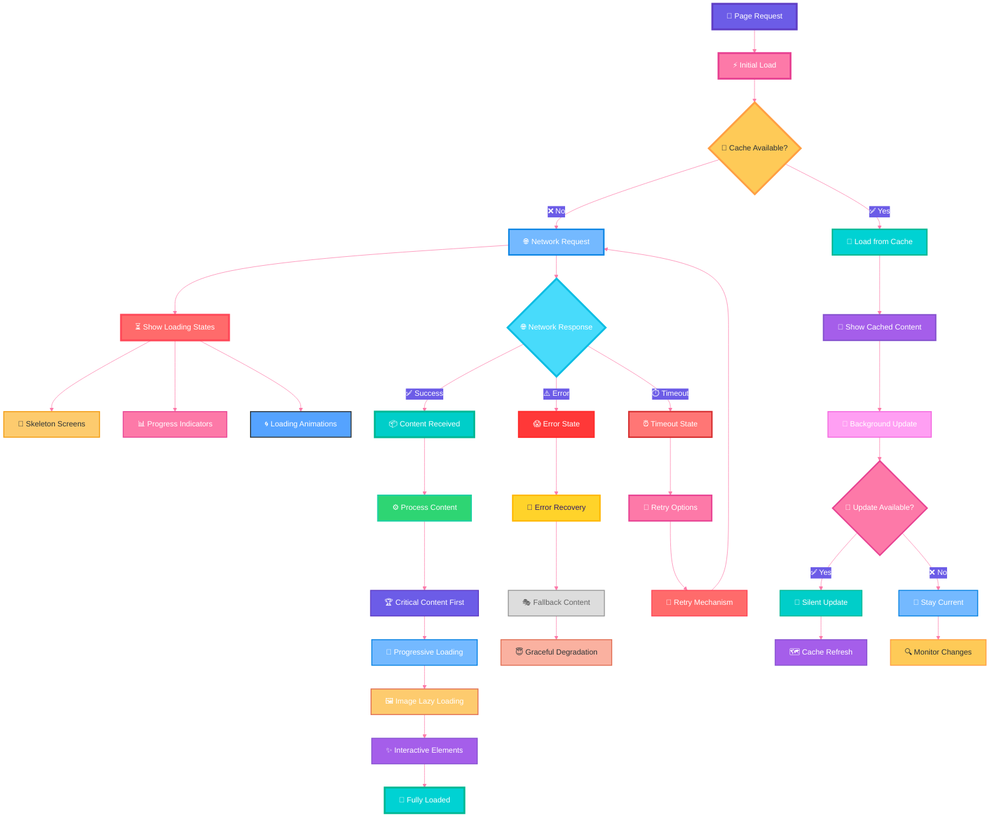

## 🎨 Component Interaction Diagrams

### 11. Navigation Component State Management

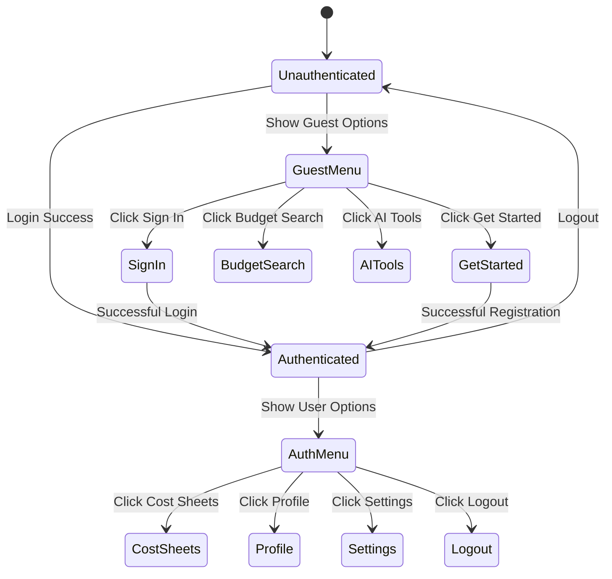

### 12. Cost Sheet Component Lifecycle

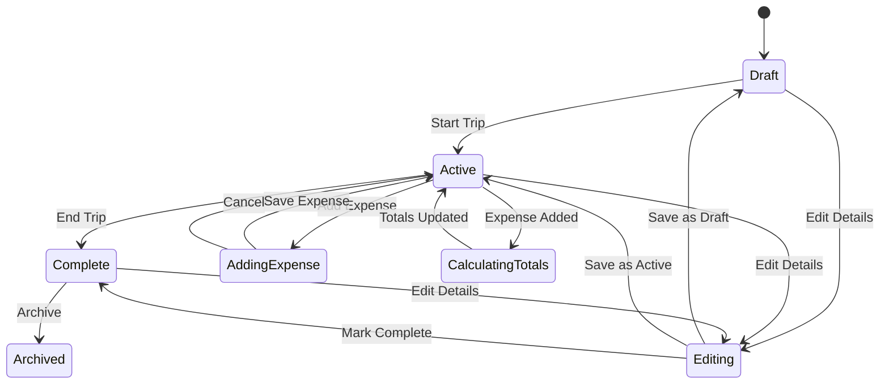

## 🎨 Component Interaction Diagrams

### 11. Navigation Component State Management

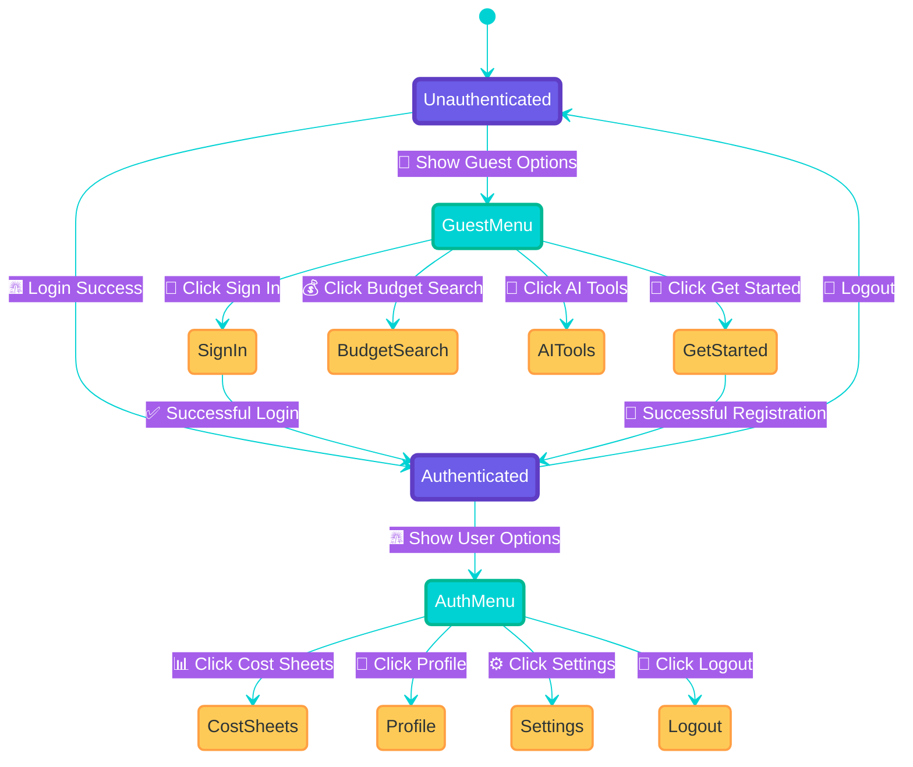

### 12. Cost Sheet Component Lifecycle

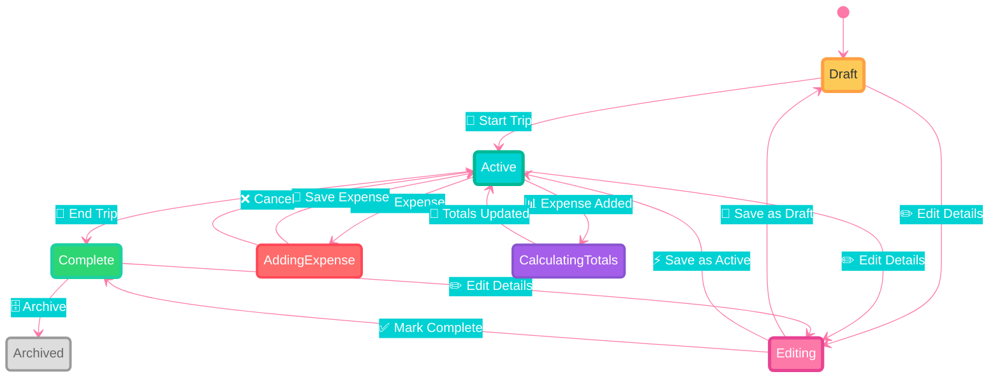

---

## 🌈 Custom Color Themes & Advanced Styling

### 🎨 Available Color Palettes

Each diagram uses a unique color palette optimized for visual clarity:

#### 🔴 Vibrant Theme (User Journey)
```
Primary: #ff6b6b (Coral Red)
Secondary: #00d2d3 (Turquoise)  
Tertiary: #a55eea (Purple)
Accent: #feca57 (Golden Yellow)
```

#### 🔵 Ocean Theme (Authentication)
```
Primary: #00d2d3 (Turquoise)
Secondary: #74b9ff (Sky Blue)
Tertiary: #fd79a8 (Pink)
Line: #ff6b6b (Coral Red)
```

#### 🟣 Galaxy Theme (Trip Planning)
```
Primary: #a55eea (Purple)
Secondary: #fd79a8 (Pink)
Tertiary: #00d2d3 (Turquoise)
Line: #feca57 (Golden)
```

#### 🟡 Sunshine Theme (Cost Management)
```
Primary: #fd79a8 (Pink)
Secondary: #6c5ce7 (Indigo)
Tertiary: #feca57 (Golden)
Line: #00d2d3 (Turquoise)
```

### 🚀 Usage Instructions

To use these colorful Mermaid diagrams:

1. **Copy any diagram code** from above (including the `%%{init}%%` theme config)
2. **Paste into a Mermaid renderer** like:
   - [🌐 Mermaid Live Editor](https://mermaid.live) - Interactive online editor
   - 🐙 **GitHub** - Automatically renders in markdown files
   - 📝 **Notion**, **Obsidian** - Tools with Mermaid support
   - 💻 **VS Code** - With Mermaid preview extensions

3. **Customize colors** by modifying:
   - `themeVariables` in the `%%{init}%%` block for global theme
   - Individual `style` lines for specific nodes
   - `classDef` declarations for reusable node classes

4. **Export formats**:
   - 🖼️ **PNG** - For presentations and documents
   - 🎨 **SVG** - For scalable graphics
   - 📄 **PDF** - For professional reports

### 🎯 Advanced Styling Tips

```mermaid
%%{init: {'theme':'base', 'themeVariables': { 'primaryColor': '#your-color' }}}%%
flowchart TD
    A[Node] --> B[Another Node]
    
    %% Individual node styling
    style A fill:#ff6b6b,stroke:#ff4757,stroke-width:4px,color:#fff
    
    %% Class-based styling (reusable)
    classDef important fill:#00d2d3,stroke:#00b894,stroke-width:3px,color:#fff
    class B important
```

These vibrant, interactive diagrams provide a comprehensive visual representation of your Budget Travel app's user experience and technical flows - perfect for development planning, stakeholder presentations, and team collaboration! 🚀✨