# Budget Travel App - Mermaid.js UI/UX Flow Diagrams

## 🌊 Interactive User Flow Diagrams

### 1. 🆕 Complete User Journey Flow

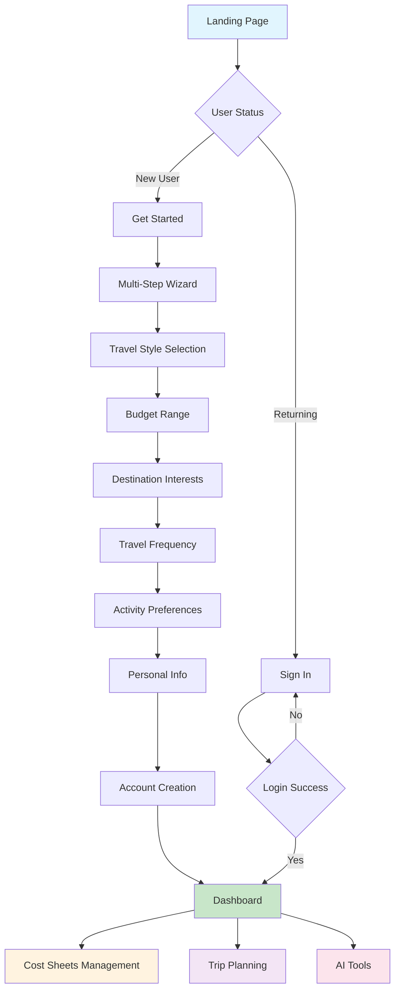

### 2. 🔐 Authentication & Access Control Flow

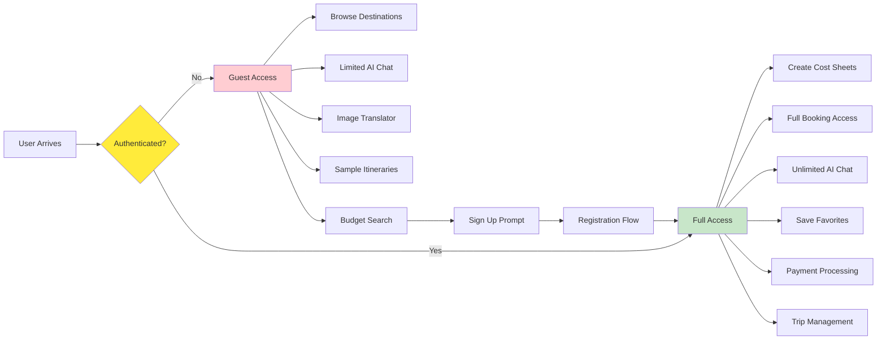

### 3. 🧭 Trip Planning Workflow

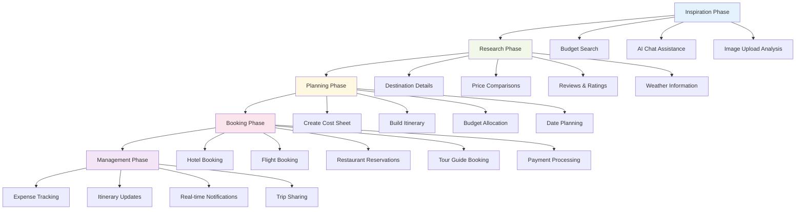

### 4. 💰 Cost Sheet Management Flow

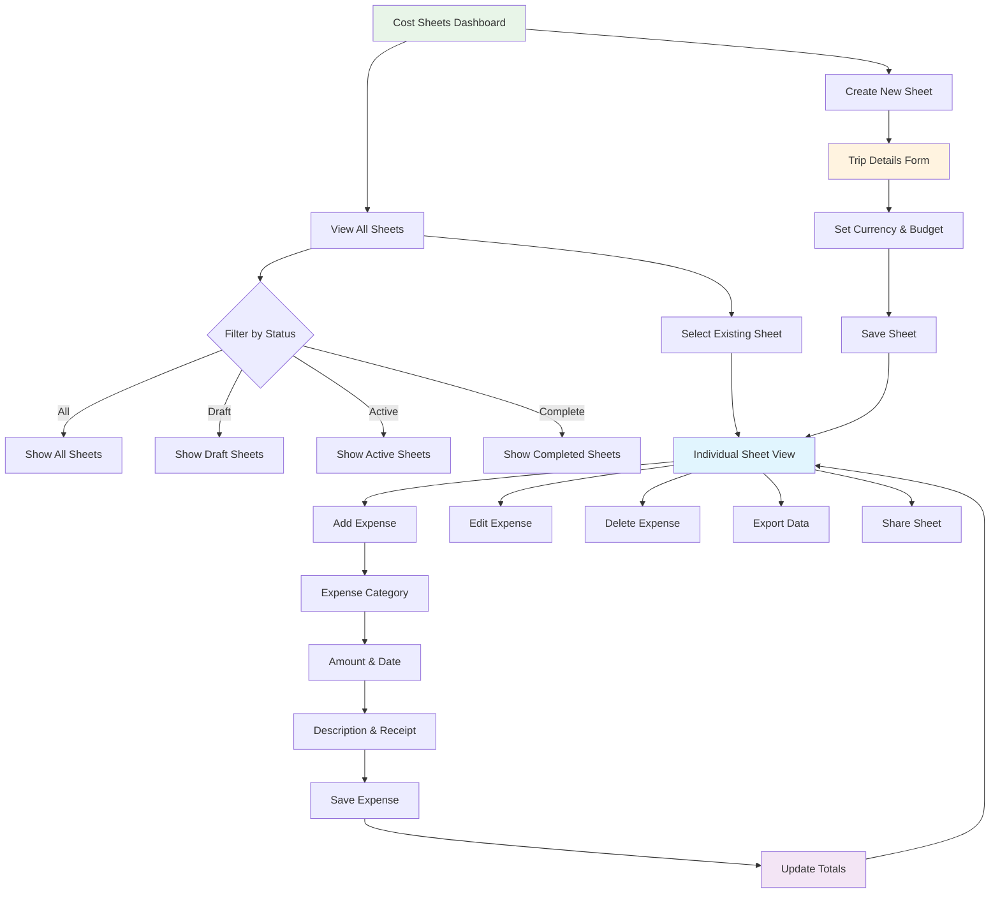

### 5. 🎯 Booking Process Flow

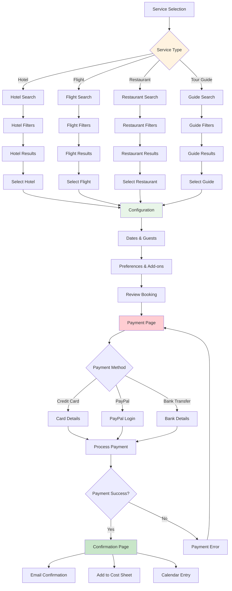

### 6. 🤖 AI Assistant Interaction Flow

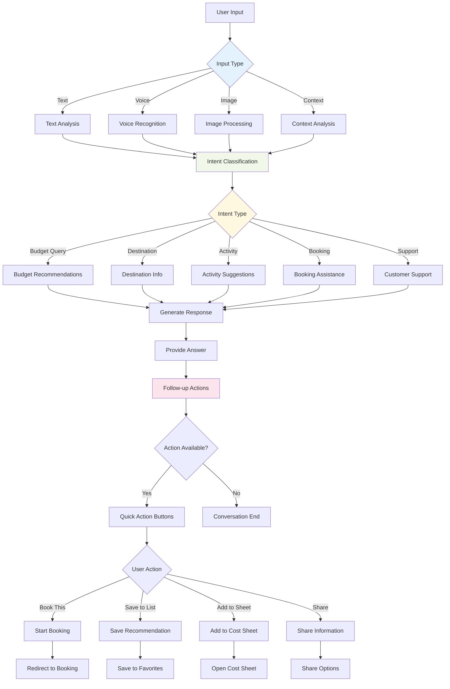

### 7. 📱 Mobile vs Desktop Experience Flow

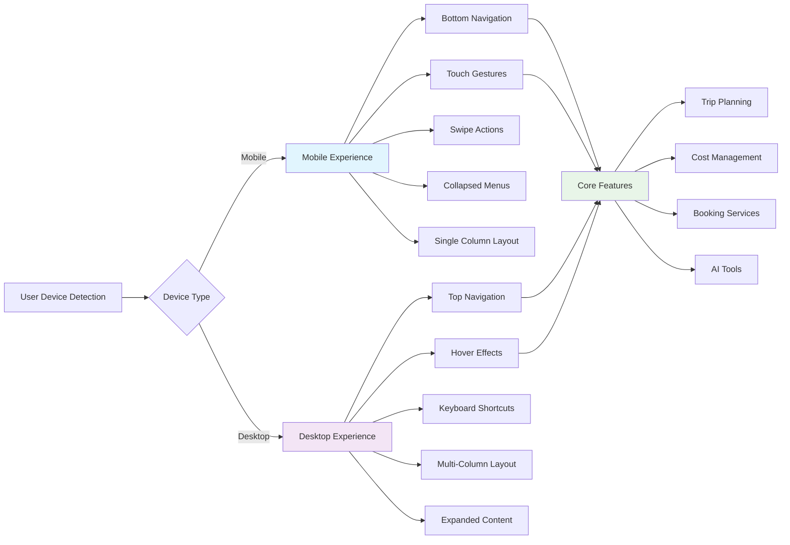

### 8. 🔄 State Management & Real-time Updates

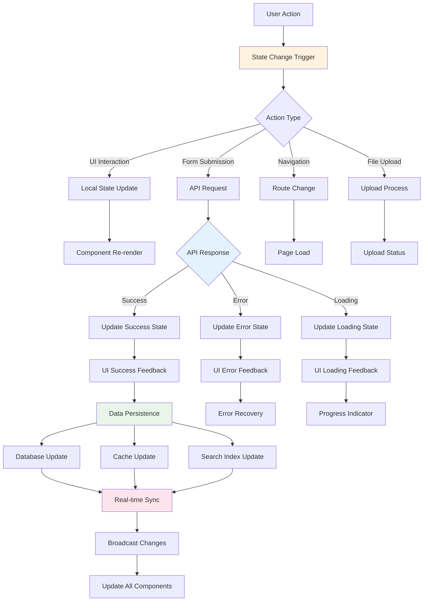

### 9. 🔍 Search & Discovery Flow

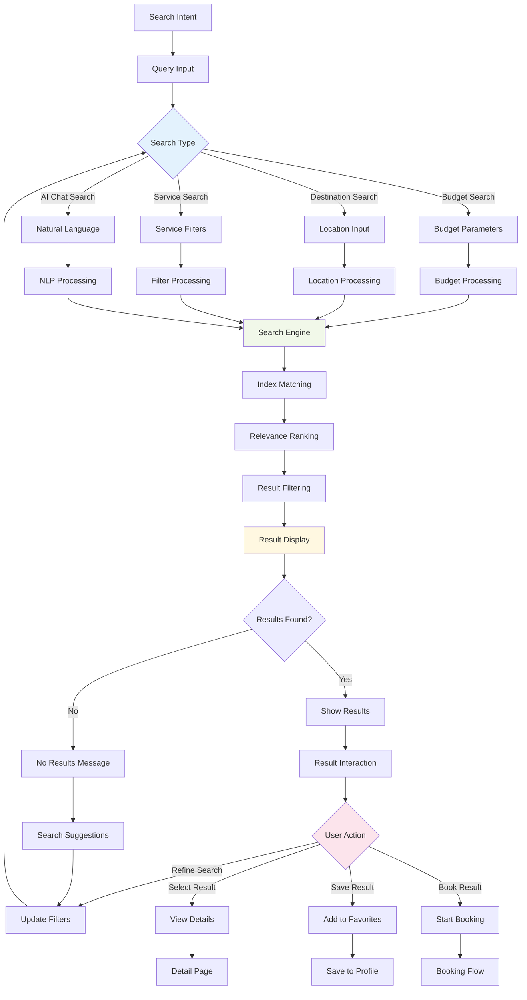

### 10. ⚡ Performance & Loading States

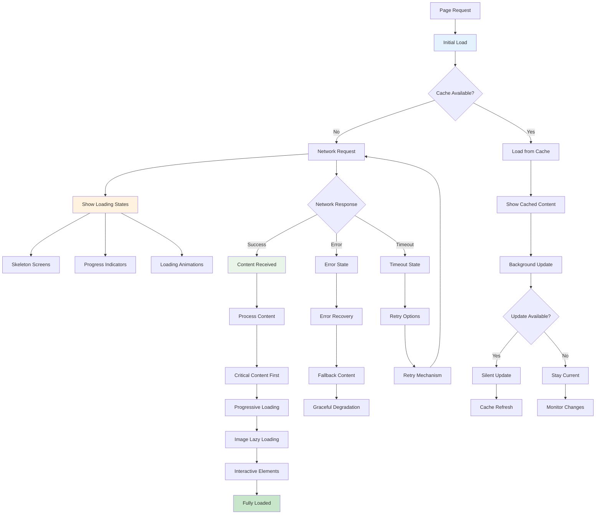

## 🎨 Component Interaction Diagrams

### 11. Navigation Component State Management

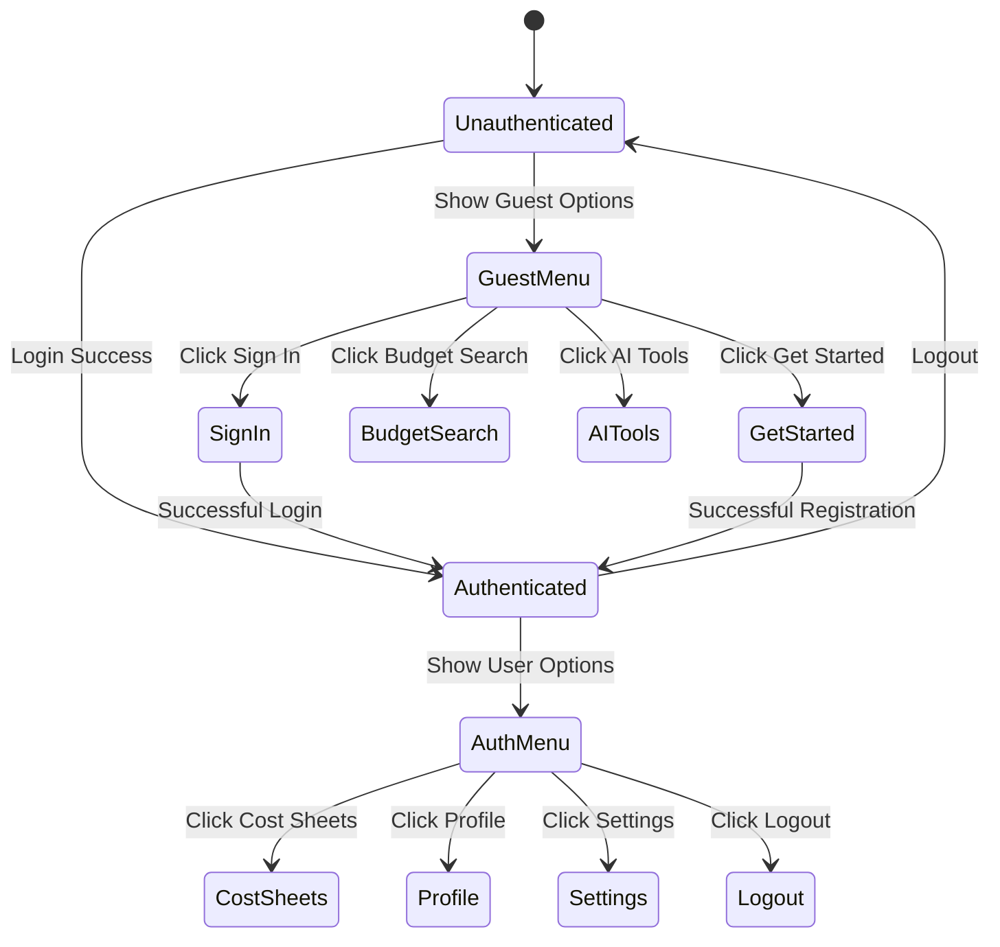

### 12. Cost Sheet Component Lifecycle

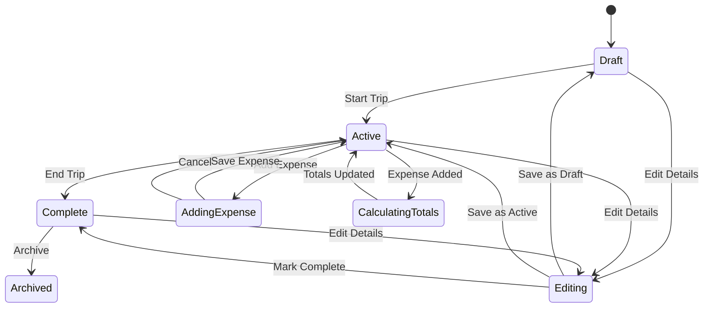

---

## 🚀 Usage Instructions

To use these Mermaid diagrams:

1. **Copy any diagram code** from above
2. **Paste into a Mermaid renderer** like:
   - [Mermaid Live Editor](https://mermaid.live)
   - GitHub (automatically renders in markdown)
   - Notion, Obsidian, or other tools with Mermaid support
   - VS Code with Mermaid extensions

3. **Customize colors and styling** by modifying the `style` lines
4. **Export as PNG/SVG** for presentations or documentation

These interactive diagrams provide a visual representation of your Budget Travel app's user experience and technical flows, making it easier to understand, present, and develop the application.