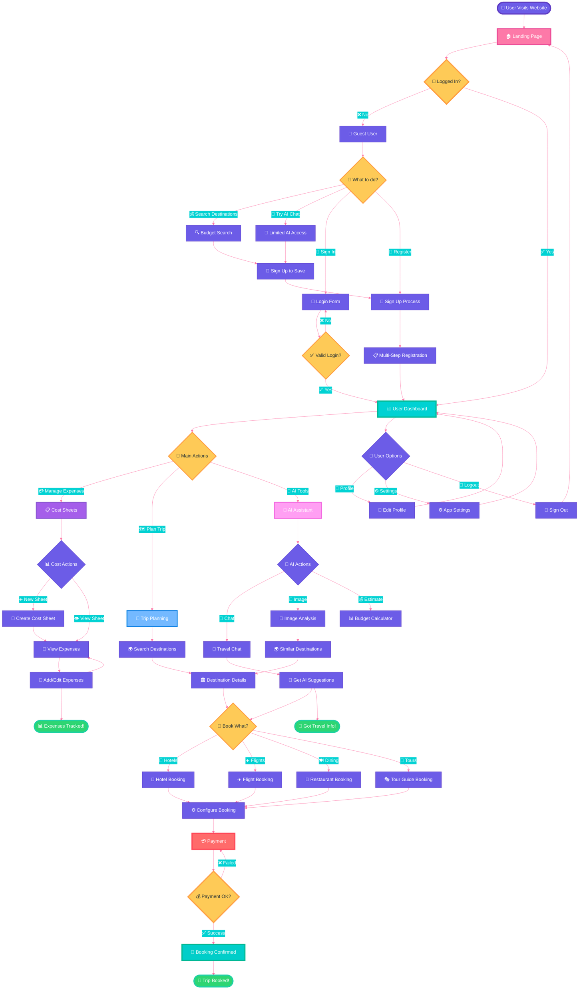

# Budget Travel Website - Simplified Activity Diagram 🌍

## 🎯 Main Website Flow - Clean & Simple

## 📋 Simplified Flow Overview

### 🎯 **Main User Paths:**

| 👤 **User Type** | 🛤️ **Primary Path** | 🎯 **Goal** |
|------------------|---------------------|-------------|
| 🆕 **New Visitor** | Landing → Guest Options → Sign Up | Create Account |
| 🔙 **Returning User** | Landing → Login → Dashboard | Access Features |
| 👤 **Guest User** | Landing → Limited Features → Upgrade Prompt | Try Before Buying |
| ✅ **Authenticated** | Dashboard → Main Features → Complete Tasks | Full Experience |

### 🔧 **Core Features:**

✅ **Simple Authentication** - Login/Register with validation  
✅ **Cost Management** - Create and track trip expenses  
✅ **Trip Planning** - Search destinations and view details  
✅ **Booking System** - Hotels, flights, dining, tours  
✅ **Payment Flow** - Secure payment with confirmation  
✅ **AI Assistant** - Chat, image analysis, budget tools  
✅ **User Profile** - Settings and preferences  

### 🎨 **Color Legend:**

- 🟣 **Purple** - Start/Core pages (Landing, Dashboard)
- 🟡 **Yellow** - Decision points (Login check, Payment success)  
- 🔴 **Red** - Payment processing
- 🔵 **Blue** - Trip planning features
- 💜 **Violet** - Cost management  
- 🟢 **Green** - Success/completion states
- 🩷 **Pink** - AI tools and chat

### 🚀 **Usage:**

1. **View Online**: Copy code to [Mermaid Live Editor](https://mermaid.live)
2. **GitHub**: Renders automatically in markdown
3. **Export**: PNG/SVG for presentations

This simplified diagram shows the essential user flows without overwhelming complexity - perfect for understanding the core website functionality at a glance! ✨