# Budget Travel Website - Unified Activity Diagram 🌍

## 🎯 Complete Website Flow - Single Activity Diagram

```mermaid
%%{init: {'theme':'base', 'themeVariables': { 'primaryColor': '#6c5ce7', 'primaryTextColor': '#fff', 'primaryBorderColor': '#5f3dc4', 'lineColor': '#fd79a8', 'secondaryColor': '#00d2d3', 'tertiaryColor': '#feca57'}}}%%
flowchart TD
    Start([🌟 User Visits Budget Travel Website]) --> Landing[🏠 Landing Page]
    
    Landing --> AuthCheck{🔐 User Authenticated?}
    
    %% Guest User Path
    AuthCheck -->|❌ No| GuestFlow[👤 Guest User Experience]
    GuestFlow --> GuestActions{🎯 Choose Action}
    
    GuestActions -->|💰 Budget Search| BudgetSearch[🔍 Budget Search Tool]
    GuestActions -->|🤖 AI Chat| LimitedChat[💬 Limited AI Chat]
    GuestActions -->|📸 Image Translate| ImageTool[📱 Image Translator]
    GuestActions -->|🌍 Browse| BrowseDestinations[🗺️ Browse Destinations]
    GuestActions -->|🔑 Sign In| SignIn[📝 Sign In Form]
    GuestActions -->|🚀 Sign Up| GetStarted[🎨 Multi-Step Registration]
    
    %% Authentication Flows
    SignIn --> LoginAttempt{🔍 Valid Credentials?}
    LoginAttempt -->|❌ No| SignIn
    LoginAttempt -->|✅ Yes| AuthSuccess[🎉 Login Success]
    
    GetStarted --> RegStep1[🎭 Step 1: Travel Style]
    RegStep1 --> RegStep2[💰 Step 2: Budget Range]
    RegStep2 --> RegStep3[🌍 Step 3: Destinations]
    RegStep3 --> RegStep4[📅 Step 4: Travel Frequency]
    RegStep4 --> RegStep5[🎪 Step 5: Activities]
    RegStep5 --> RegStep6[👤 Step 6: Personal Info]
    RegStep6 --> RegStep7[🔐 Step 7: Account Creation]
    RegStep7 --> RegComplete[✅ Registration Complete]
    
    %% Authenticated User Flow
    AuthCheck -->|✅ Yes| AuthFlow[🎯 Authenticated User]
    AuthSuccess --> AuthFlow
    RegComplete --> AuthFlow
    
    AuthFlow --> Dashboard[📊 User Dashboard]
    Dashboard --> MainActions{🎯 Main Actions}
    
    %% Cost Sheet Management
    MainActions -->|💳 Cost Sheets| CostSheetDash[📋 Cost Sheets Dashboard]
    CostSheetDash --> CostActions{📊 Cost Sheet Actions}
    
    CostActions -->|➕ Create New| NewCostSheet[📝 Create Cost Sheet Form]
    CostActions -->|👁️ View Existing| ViewCostSheet[📄 View Cost Sheet Details]
    CostActions -->|📊 Filter| FilterCosts[🔍 Filter by Status]
    
    NewCostSheet --> CostForm[🌍 Trip Details Form]
    CostForm --> SetBudget[💰 Set Currency & Budget]
    SetBudget --> SaveCostSheet[💾 Save Cost Sheet]
    SaveCostSheet --> ViewCostSheet
    
    ViewCostSheet --> ExpenseActions{💳 Expense Actions}
    ExpenseActions -->|➕ Add| AddExpense[💸 Add New Expense]
    ExpenseActions -->|✏️ Edit| EditExpense[📝 Edit Expense]
    ExpenseActions -->|🗑️ Delete| DeleteExpense[❌ Delete Expense]
    ExpenseActions -->|📤 Export| ExportData[📊 Export Cost Data]
    ExpenseActions -->|🤝 Share| ShareSheet[📱 Share Cost Sheet]
    
    AddExpense --> ExpenseForm[📝 Expense Entry Form]
    ExpenseForm --> ExpenseCategory[🏷️ Select Category]
    ExpenseCategory --> ExpenseAmount[💰 Enter Amount & Date]
    ExpenseAmount --> ExpenseDesc[📄 Description & Receipt]
    ExpenseDesc --> SaveExpense[💾 Save Expense]
    SaveExpense --> UpdateTotals[🔄 Update Totals]
    UpdateTotals --> ViewCostSheet
    
    %% Trip Planning Flow
    MainActions -->|🗺️ Trip Planning| TripPlanning[🧭 Trip Planning Hub]
    TripPlanning --> PlanActions{🎯 Planning Actions}
    
    PlanActions -->|🔍 Search Destinations| DestSearch[🌍 Destination Search]
    PlanActions -->|💰 Budget Search| BudgetSearch
    PlanActions -->|🤖 AI Assistant| FullChat[🤖 Full AI Chat Access]
    
    %% Destination & Booking Flow
    DestSearch --> DestinationPage[🏛️ Destination Details]
    BudgetSearch --> SearchResults[📋 Search Results]
    SearchResults --> DestinationPage
    
    DestinationPage --> BookingTabs{🎯 Booking Options}
    BookingTabs -->|🏨 Hotels| HotelBooking[🏩 Hotel Search & Booking]
    BookingTabs -->|✈️ Flights| FlightBooking[🛫 Flight Search & Booking]
    BookingTabs -->|🍽️ Restaurants| RestaurantBooking[🍴 Restaurant Reservations]
    BookingTabs -->|👥 Tour Guides| GuideBooking[🎭 Tour Guide Booking]
    
    %% Hotel Booking Sub-flow
    HotelBooking --> HotelFilters[🔍 Apply Hotel Filters]
    HotelFilters --> HotelResults[🏨 Hotel Results]
    HotelResults --> SelectHotel[✅ Select Hotel]
    
    %% Flight Booking Sub-flow
    FlightBooking --> FlightFilters[🔍 Apply Flight Filters]
    FlightFilters --> FlightResults[✈️ Flight Results]
    FlightResults --> SelectFlight[✅ Select Flight]
    
    %% Restaurant Booking Sub-flow
    RestaurantBooking --> RestFilters[🔍 Restaurant Filters]
    RestFilters --> RestResults[🍽️ Restaurant Results]
    RestResults --> SelectRestaurant[✅ Select Restaurant]
    
    %% Guide Booking Sub-flow
    GuideBooking --> GuideFilters[🔍 Guide Filters]
    GuideFilters --> GuideResults[👥 Guide Results]
    GuideResults --> SelectGuide[✅ Select Guide]
    
    %% Unified Booking Configuration
    SelectHotel --> BookingConfig[⚙️ Booking Configuration]
    SelectFlight --> BookingConfig
    SelectRestaurant --> BookingConfig
    SelectGuide --> BookingConfig
    
    BookingConfig --> SetDatesGuests[📅 Set Dates & Guests]
    SetDatesGuests --> AddPreferences[⭐ Add Preferences & Add-ons]
    AddPreferences --> ReviewBooking[👁️ Review Booking Details]
    ReviewBooking --> PaymentPage[💳 Payment Page]
    
    %% Payment Processing
    PaymentPage --> PaymentMethod{💸 Payment Method}
    PaymentMethod -->|💳 Credit Card| CardPayment[🏦 Card Details]
    PaymentMethod -->|💰 PayPal| PayPalLogin[🟦 PayPal Login]
    PaymentMethod -->|🏛️ Bank Transfer| BankTransfer[🏦 Bank Details]
    
    CardPayment --> ProcessPayment[⚡ Process Payment]
    PayPalLogin --> ProcessPayment
    BankTransfer --> ProcessPayment
    
    ProcessPayment --> PaymentResult{💳 Payment Success?}
    PaymentResult -->|❌ Failed| PaymentError[⚠️ Payment Error]
    PaymentError --> PaymentPage
    
    PaymentResult -->|✅ Success| PaymentSuccess[🎉 Payment Successful]
    PaymentSuccess --> Confirmation[📧 Booking Confirmation]
    Confirmation --> EmailSent[📧 Email Confirmation]
    Confirmation --> AddToCalendar[📅 Add to Calendar]
    Confirmation --> AddToCostSheet[📊 Add to Cost Sheet]
    
    %% AI Tools Flow
    MainActions -->|🤖 AI Tools| AIHub[🧠 AI Tools Hub]
    FullChat --> AIHub
    LimitedChat --> SignUpPrompt[🔔 Sign Up Prompt]
    SignUpPrompt --> GetStarted
    
    AIHub --> AIActions{🤖 AI Actions}
    AIActions -->|💬 Chat Assistant| ChatBot[🤖 Travel Chat Assistant]
    AIActions -->|📸 Image Analysis| ImageTool
    AIActions -->|💰 Budget Estimation| ExpenseEstimator[📊 Expense Estimator]
    
    ChatBot --> ChatQuery[💭 Enter Travel Query]
    ChatQuery --> AIProcessing[🧠 AI Processing]
    AIProcessing --> AIResponse[💬 AI Response]
    AIResponse --> ActionButtons{🎯 Follow-up Actions?}
    
    ActionButtons -->|📖 Book This| StartBooking[🚀 Start Booking Flow]
    ActionButtons -->|💾 Save to List| SaveToFavorites[⭐ Save to Favorites]
    ActionButtons -->|📊 Add to Sheet| QuickAddCost[📈 Quick Add to Cost Sheet]
    ActionButtons -->|🤝 Share| ShareInfo[📱 Share Information]
    ActionButtons -->|💬 Continue Chat| ChatBot
    
    StartBooking --> BookingTabs
    
    ImageTool --> UploadImage[📸 Upload Travel Image]
    UploadImage --> ImageAnalysis[🔍 AI Image Analysis]
    ImageAnalysis --> ImageResults[🌍 Similar Destinations]
    ImageResults --> ImageActions{🎯 Image Actions}
    ImageActions -->|🌍 Explore Destination| DestinationPage
    ImageActions -->|💾 Save Recommendations| SaveToFavorites
    ImageActions -->|📸 Upload Another| ImageTool
    
    %% Navigation & Settings
    Dashboard --> UserActions{👤 User Actions}
    UserActions -->|👤 Profile| UserProfile[👤 User Profile Settings]
    UserActions -->|⚙️ Settings| AppSettings[⚙️ App Settings]
    UserActions -->|🚪 Logout| LogoutProcess[🚪 Logout]
    
    UserProfile --> EditProfile[✏️ Edit Profile Info]
    EditProfile --> SaveProfile[💾 Save Profile Changes]
    SaveProfile --> Dashboard
    
    AppSettings --> SettingsOptions{⚙️ Settings Options}
    SettingsOptions -->|🔔 Notifications| NotificationSettings[🔔 Notification Settings]
    SettingsOptions -->|🌍 Language| LanguageSettings[🌍 Language Settings]
    SettingsOptions -->|🌙 Theme| ThemeSettings[🎨 Theme Settings]
    SettingsOptions -->|🔐 Privacy| PrivacySettings[🛡️ Privacy Settings]
    
    NotificationSettings --> Dashboard
    LanguageSettings --> Dashboard
    ThemeSettings --> Dashboard
    PrivacySettings --> Dashboard
    
    LogoutProcess --> Landing
    
    %% Guest Interactions leading to sign up
    BudgetSearch --> GuestResults[📊 Budget Search Results]
    GuestResults --> GuestSignUp[🔔 Sign Up to Save Results]
    GuestSignUp --> GetStarted
    
    BrowseDestinations --> GuestBrowse[👁️ View Sample Destinations]
    GuestBrowse --> GuestSignUp
    
    %% End states
    EmailSent --> End1([🎉 Booking Complete])
    AddToCalendar --> End1
    AddToCostSheet --> End1
    ExportData --> End2([📊 Data Exported])
    ShareSheet --> End3([🤝 Content Shared])
    ShareInfo --> End3
    SaveToFavorites --> End4([⭐ Saved to Favorites])
    
    %% Styling for different sections
    style Start fill:#6c5ce7,stroke:#5f3dc4,stroke-width:4px,color:#fff
    style Landing fill:#fd79a8,stroke:#e84393,stroke-width:3px,color:#fff
    style Dashboard fill:#00d2d3,stroke:#00b894,stroke-width:4px,color:#fff
    style PaymentPage fill:#ff6b6b,stroke:#ff4757,stroke-width:4px,color:#fff
    style PaymentSuccess fill:#00cec9,stroke:#00b894,stroke-width:4px,color:#fff
    style End1 fill:#2ed573,stroke:#1dd1a1,stroke-width:4px,color:#fff
    style End2 fill:#2ed573,stroke:#1dd1a1,stroke-width:4px,color:#fff
    style End3 fill:#2ed573,stroke:#1dd1a1,stroke-width:4px,color:#fff
    style End4 fill:#2ed573,stroke:#1dd1a1,stroke-width:4px,color:#fff
    
    %% Decision points styling
    style AuthCheck fill:#feca57,stroke:#ff9f43,stroke-width:4px,color:#2d3436
    style LoginAttempt fill:#feca57,stroke:#ff9f43,stroke-width:3px,color:#2d3436
    style PaymentResult fill:#feca57,stroke:#ff9f43,stroke-width:4px,color:#2d3436
    style GuestActions fill:#feca57,stroke:#ff9f43,stroke-width:3px,color:#2d3436
    style MainActions fill:#feca57,stroke:#ff9f43,stroke-width:3px,color:#2d3436
    style BookingTabs fill:#feca57,stroke:#ff9f43,stroke-width:3px,color:#2d3436
    style PaymentMethod fill:#feca57,stroke:#ff9f43,stroke-width:3px,color:#2d3436
    
    %% Key process styling
    style CostSheetDash fill:#a55eea,stroke:#8854d0,stroke-width:3px,color:#fff
    style ViewCostSheet fill:#a55eea,stroke:#8854d0,stroke-width:3px,color:#fff
    style TripPlanning fill:#74b9ff,stroke:#0984e3,stroke-width:3px,color:#fff
    style DestinationPage fill:#74b9ff,stroke:#0984e3,stroke-width:3px,color:#fff
    style AIHub fill:#ff9ff3,stroke:#f368e0,stroke-width:3px,color:#fff
    style ChatBot fill:#ff9ff3,stroke:#f368e0,stroke-width:3px,color:#fff
    
    %% Registration flow styling
    style GetStarted fill:#fdcb6e,stroke:#f39c12,stroke-width:3px,color:#2d3436
    style RegStep1 fill:#fdcb6e,stroke:#e17055,stroke-width:2px,color:#fff
    style RegStep2 fill:#fdcb6e,stroke:#e17055,stroke-width:2px,color:#fff
    style RegStep3 fill:#fdcb6e,stroke:#e17055,stroke-width:2px,color:#fff
    style RegStep4 fill:#fdcb6e,stroke:#e17055,stroke-width:2px,color:#fff
    style RegStep5 fill:#fdcb6e,stroke:#e17055,stroke-width:2px,color:#fff
    style RegStep6 fill:#fdcb6e,stroke:#e17055,stroke-width:2px,color:#fff
    style RegStep7 fill:#fdcb6e,stroke:#e17055,stroke-width:2px,color:#fff
    style RegComplete fill:#00cec9,stroke:#00b894,stroke-width:3px,color:#fff
```

## 📋 Activity Diagram Legend

### 🎯 **Flow Sections:**

| Color | Section | Description |
|-------|---------|-------------|
| 🟣 **Purple** | Core Navigation | Landing, Dashboard, Main Entry Points |
| 🔴 **Red/Pink** | Authentication | Sign In, Registration, Payment |
| 🔵 **Blue** | Trip Planning | Destination Search, Booking, Travel Tools |
| 💜 **Violet** | Cost Management | Cost Sheets, Expenses, Budget Tracking |
| 🟡 **Yellow** | Decision Points | All user choice moments and conditionals |
| 🟢 **Green** | Success States | Completed actions, confirmations |
| 🟠 **Orange** | Registration | Multi-step signup process |

### 📊 **Key Features Covered:**

✅ **Complete User Journey** - From landing to booking completion  
✅ **Authentication Flow** - Guest vs. authenticated user paths  
✅ **Multi-step Registration** - 7-step onboarding process  
✅ **Cost Sheet Management** - Create, view, edit, export expenses  
✅ **Trip Planning** - Search, browse, plan itineraries  
✅ **Booking System** - Hotels, flights, restaurants, guides  
✅ **Payment Processing** - Multiple payment methods and confirmation  
✅ **AI Tools Integration** - Chat, image analysis, budget estimation  
✅ **User Settings** - Profile, preferences, notifications  
✅ **Guest Experience** - Limited access with upgrade prompts  

### 🎨 **Usage Instructions:**

1. **View in Mermaid Live Editor**: Copy the entire diagram code to [https://mermaid.live](https://mermaid.live)
2. **GitHub Rendering**: The diagram will render automatically in GitHub markdown
3. **Export Options**: Save as PNG, SVG, or PDF for presentations
4. **Interactive Exploration**: Click nodes to understand user flow paths

This unified activity diagram provides a complete overview of how your Budget Travel website operates, showing all major user paths, decision points, and feature integrations in a single, comprehensive visualization! 🚀